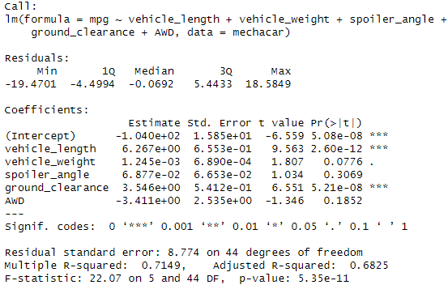
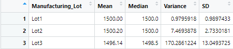
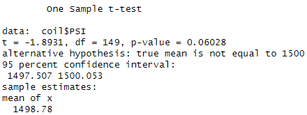
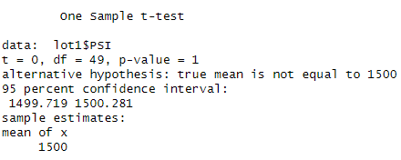
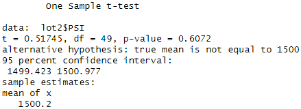
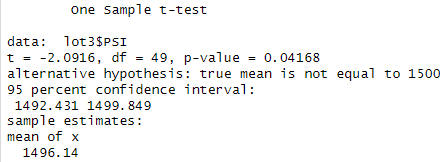

# MechaCar Statistical Analysis

## Linear Regression to Predict MPG
In this section I performed a multiple linear regression test on the MechaCar_mpg.csv dataset in order to answer the following questions:

 1. Which variables/coefficients provided a non-random amount of variance to the mpg values in the dataset?
 2. Is the slope of the linear model considered to be zero? Why or why not?
 3. Does this linear model predict mpg of MechaCar prototypes effectively? Why or why not?

The answers are as follows:

 1. The vehicle_length and ground_clearance had a non-random amount of variance since their p-values are very small.
 2. The slope is not zero because the p-values of vehicle_length and ground_clearance show significance.
 3. To determine how effective this linear model is at predicting the mpg of MechaCar prototypes, we look at the r-squared value which is 0.7149. I do not believe that this is effective enough to accurately predict mpg to MechaCar prototypes effectively.

## Summary Statistics on Suspension Coils  

In this section I retrieved summary statistics on suspension coils to answer the following question:

 1. The design specifications for the MechaCar suspension coils dictate that the variance of the suspension coils must not exceed 100 pounds per square inch. Does the current manufacturing data meet this design specification for all manufacturing lots in total and each lot individually? Why or why not?

The answer is as follows:

 1. In total, the MechaCar suspension coils meet the design specification of less than 100 lb/in^2^ of variance at only 76.23 lb/in^2^. Looking at each lot individually tells a different story though. Lot 1 and 2 both meet the design specification by far but lot 3 does not. Lot 3's variance is 170.29 lb/in^2^, well over the specified 100 lb/in^2^.

#### Total Summary Table

#### Lot Summary Table

## T-Tests on Suspension Coils  
In this section I performed t-tests on suspension coil data set to see if there was a statistically significant difference from the populated mean of 1500 lb/in^2^. I found that the there's no statistically significant difference for all the lots combined, lot 1, or lot 2. However, I did find a statistically siginificant difference for lot 3 since the p-value, 0.04168, is less than .05. This means that, assuming a significance level of 95%, lot 3 does have a significant difference to the population mean.

#### Combined Lots T-Test

#### Lot 1 T-Test

#### Lot 2 T-Test

#### Lot 3 T-Test

## Study Design: MechaCar vs Competition
In this section, I will describe a potential study to demonstrate how MechaCar compares to its competition by answering the following questions:

 1. What metric or metrics are you going to test?
 2. What is the null hypothesis or alternative hypothesis?
 3. What statistical test would you use to test the hypothesis? And why?  
 4. What data is needed to run the statistical test?

The answers to these questions are:

 1. I will be testing the fuel efficiency of MechaCar compared to its competitors.
 2. The null hypothesis is that all cars of the same class, regardless of brand, will have the same fuel efficiencies. The alternative hypothesis is that there's a difference in fuel efficiencies for cars of the same class regardless of brand
 3. I would use an ANOVA test since we're interested in comparing the means across more than two groups.
 4. I would need the fuel efficiency data of the MechaCar competitors as well as the class and brand of vehicle
